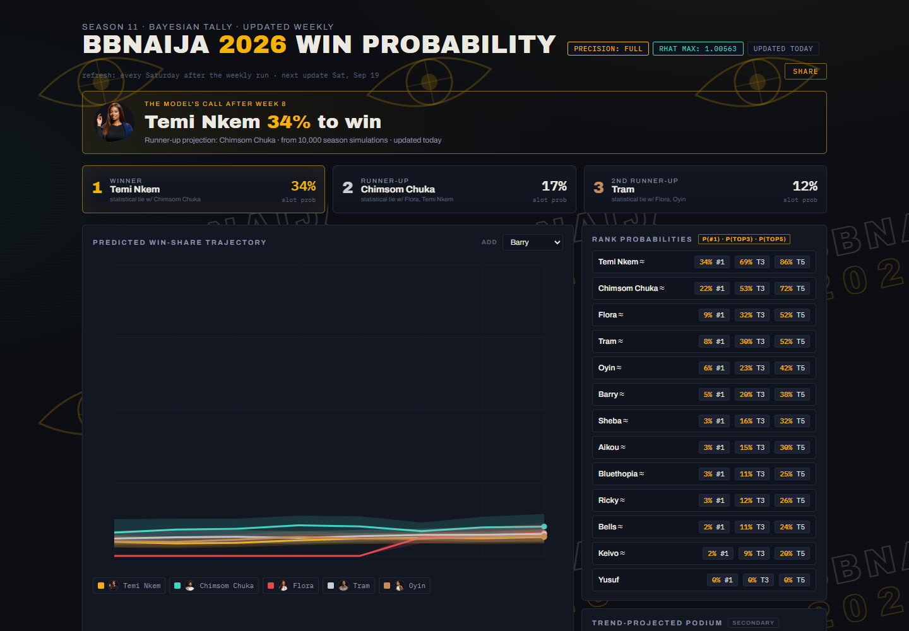
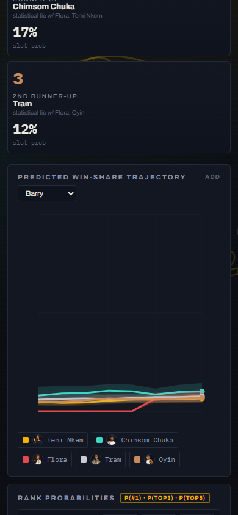

# BBNaija 2026 Win Probability — a $0 fan-poll aggregation engine

[](https://batestguy.github.io/bbnaija2026/)
[](https://github.com/batestguy/bbnaija2026/actions/workflows/deploy.yml)
[](#testing)

**Live:** https://batestguy.github.io/bbnaija2026/ ·
Mirrors: [HF Space](https://batestguy-bbnaija2026-dashboard.static.hf.space/) ·
[HF Dataset archive](https://huggingface.co/datasets/batestguy/bbnaija2026-predictions)

A transparent aggregation engine that reads **free fan polls** every week — the
bbnaijadaily vote widget, hand-logged rows, official bottom-N/top-N reports —
and turns them into **win probabilities, a podium projection, and an at-risk
watch**. The aggregated share *is* the win probability; every published number
is hand-checkable against the poll log. Everything runs locally on a laptop;
everything is free.

> **2026-09-22 engine overhaul (owner decision):** the original Bayesian MCMC
> (blog-CPI → ZINB/Cox → BMA) was **retired in place** and replaced by the
> poll-matrix engine specified in `poll-matrix-engine-spec.md` (21 owner
> decisions). Why: the MCMC measured *press coverage* while fans watch *polls* —
> week 8 put Chimsom Chuka at P(#1)=0.365 while every fan poll had her last
> (5.31%), and a coverage collapse sank the poll leader Temi Nkem to 0.040.
> The polls are now the engine, not an afterthought. First certified run:
> **Saturday 2026-09-26**. Until then the dashboard still serves the final
> MCMC output. History of the retired engine is at the bottom of this file.



## What you'll see on the dashboard

| Panel | What it tells you |
|---|---|
| **Hero call** | The engine's current pick to win, with the headline probability |
| **Trajectory chart** | Aggregated share per week for the top 5 (+ anyone you add), with 89% bootstrap bands. Hover any line for the exact number |
| **Podium strip** | Winner / runner-up / 2nd runner-up with slot probabilities and statistical-tie markers |
| **Rank chips** | P(#1), P(top-3), P(top-5) for all active housemates — plus **momentum** (Δ share week-over-week) and `carried` flags |
| **At-risk panel** | Lowest-share actives; `*` marks official bottom-N flags |
| **Gambit auto-finalists** | Appears only while the twist is active: immune housemates with a finale seat and no poll numbers (inert since week 6 — both members were released) |
| **House status** | Full 24-housemate roster: active, evicted (wk N), walked |
| **Prediction vs outcome** | Grows weekly: was last week's called winner right? Brier-scored |

*(Screenshots below are from the Sep-20 MCMC run and predate the poll-engine
cutover; the panel shell is unchanged.)*

<p align="center"></p>

---

## How it works — the pipeline

```
 fan polls ──► scrape_polls.py ──► poll_matrix.py ──► aggregate.py ──► predictions.json ──► deploy.yml
 (bbnaijadaily  (state-aware         (long-format      (weights →       (share = P(win),      (schema gate
  widget,       TotalPoll parser,    matrix, latest-    aggregate →      89% bootstrap CI,     then Pages +
  ngnews247,    ngnews RSS,          wins dedupe,       constraints →    rank probs,           HF Space +
  manual log)   manual log)          Gambit gate,       bootstrap)       podium, pairwise)     dataset)
                                     transcribed seeds)
```

Every stage is a tested CLI; `run_weekly.py` orchestrates them end-to-end on
Saturdays. The blog scraper still runs for archive continuity but **feeds
nothing** — CPI is retired.

**Step 1 — Fetch the polls (the load-bearing input).** One isolated parser per
source: the bbnaijadaily TotalPoll widget (server-rendered, state-aware —
after the Saturday 21:00 close it reports `closed` and nothing is fabricated),
ngnews247 YouTube RSS titles (rank-only), and the hand-logged `docs/polls.json`
rows (FB groups, transcribed result images). No X/Twitter anywhere — the free
read tier was removed for new developers in Feb 2026.

**Step 2 — The matrix.** Every observation becomes one row in a long-format
table (schema from the original brief, extended with audit columns): poll URL,
timestamp, week, sample size, source grade, provenance, and one column per
housemate (evicted columns retained forever). Housemates in an *active* Gambit
period never enter the matrix. Transcribed past-week finals are legitimate
seed rows (grade A, recency-discounted) — current-week finals never anchor the
current week.

**Step 3 — Aggregate.** The frozen sequence, with every parameter in
`config/poll_engine.json` and stamped into each run's output.

**Step 4 — Products.** 1,000 bootstrap replicates → 89% bands, rank
probabilities, podium slot odds, pairwise P(A>B). No new sampling machinery;
the point estimate stays exactly the hand-verifiable weighted aggregation.

**Step 5 — Deploy.** A schema gate validates `predictions.json`; only then does
GitHub Pages publish, the HF Static Space mirror sync, and the dataset archive
update. A failed gate leaves the last good file live everywhere.

---

## The engine, precisely

### Step 1 — Filter (window, active set, minimum coverage)

Keep observations from the last `window_weeks = 3` weeks. Restrict each row to
the housemates it covers and to currently-active housemates. Drop any row
covering fewer than 2 eligible housemates.

### Step 2 — Weight each observation

```
w_k = q_k × min(n_k, cap) × λ^Δt_k
```

| Symbol | Meaning | Value |
|---|---|---|
| `q_k` | source grade: A=1.0 (bbnaijadaily widget, transcribed widget finals, official bottom/top-N), B=0.7 (FB-group manual rows), C=0.5 (ngnews247 rank titles) | from config |
| `n_k` | actual votes for the whole poll (pseudo-n for constraint rows: ngnews 50, official-N 200) | capped |
| `cap` | max effective sample size — deliberately tames the widget's ~600k weekly votes so other sources keep influence | **5,000** |
| `λ` | recency decay — one week of age multiplies weight by 0.6 | 0.6 |
| `Δt_k` | age in weeks | — |

### Step 3 — Aggregate full-share observations

Each row's shares are renormalised over the housemates it covers, then the
per-housemate share is the weight-weighted mean across rows:

```
S_i = Σ_k w_k · s_i,k  /  Σ_k w_k          (full_share rows only)
```

**Carry-forward:** actives the polls didn't cover this week (nominated polls
only cover nominees) inherit last week's aggregated share and are flagged
`carried`. Actives never measured in the window get the *minimum measured
share* as a conservative floor, flagged `unmeasured`. Nothing is invented;
both flags are visible in the run review and on the dashboard.

### Step 4 — Official constraints, softened on conflict

Official bottom-N flags cap a housemate at `m×(1−ε)` where *m* is the minimum
share among unflagged actives (ε = 0.01); top-N flags floor at `m×(1+ε)`.

**Soften-on-conflict:** when a constraint's ordering agrees with the poll
aggregate, it applies in full. When it conflicts — e.g. an official bottom
placement for someone the polls rank mid-table — the affected share is pulled
**halfway** toward the bound instead of fully capped. Every application
(agree, soften, or no-op) is logged with before/after shares in
`predictions.json → polls.constraint_log`.

ngnews247 titles ("WEEK 9 VOTE POLL RESULT: KEIVO & RICKY") become top-2
constraint rows — grade C, pseudo-n 50 — never shares. The official-N adapter
ships even though no official ranking source has been found this season:
zero rows is a valid, logged state.

### Step 5 — Renormalise, then bootstrap

Shares renormalise over all eligible actives. Then **B = 1,000 replicates**
(seeded, deterministic), each resampling:

1. **observations** with replacement, probability ∝ w_k (between-poll
   disagreement), and
2. **each poll's voters** — a multinomial draw over that row's shares with
   n = its capped sample size (within-poll sampling noise).

Both layers matter: without voter resampling, a single-poll window would
produce zero-width intervals and falsely decisive P(A>B) — thin data must
widen the bands, not eliminate them. The **point estimate never uses voter
noise**; published shares stay exactly the Step-3 aggregation.

Reported per housemate: point share `S_i`, the **89% interval** (5.5th/94.5th
percentiles), P(#1)/P(top-3)/P(top-5) as replicate fractions, P(A>B) for every
pair, podium slots with slot probabilities, and momentum = `S_i(this week) −
S_i(last week)`.

### The mapping rule: share = P(win)

There is no extra model between the aggregated share and the win probability —
**S_i *is* P(win)**, renormalised over non-Gambit actives. No softmax, no
Dirichlet layer, no momentum tilt. The owner can verify any week's table by
hand from `docs/polls.json` in a few minutes. Statistical ties follow the
decision rules: P(A>B) > 0.90 clear lead, 0.60–0.90 leaning, < 0.60 too close
to call (marked "≈", alphabetical tie-break for display).

### The Gambit twist rule

Housemates in an *active* Gambit period (read only from
`config/twist.json → gambit_periods`) are **excluded from the matrix and the
standings entirely** — they appear in the dashboard's auto-finalists strip
with no numbers. History: the week-1 vote elected Flora + Aikou to immunity +
guaranteed finale seats with the grand prize disqualified; "Operation Release
the Gambit" (Aug 30) returned both to prize eligibility from week 6, so the
exclusion is currently inert and reactivates automatically if the config ever
gains new periods.

### Honesty labels

- **89% intervals everywhere** (owner decision — overrides the original
  brief's 95% to keep the dashboard convention consistent).
- `engine.params` in every `predictions.json` records the exact cap, λ, ε,
  window, replicate count, seed and grades that produced the published numbers.
- The run review prints a **data-sufficiency block** (rows in window, sources
  reporting, weeks, carried/unmeasured lists) and a THIN-WINDOW warning when
  rows ≤ 2 — the human reads it before pushing. There is no R-hat gate
  anymore; bootstrap is deterministic and unconditionally reproducible
  (`bootstrap_seed`).
- A dark/missing/closed poll degrades the run to seeds-only with wide bands —
  never fabricated, never blocked silently.

---

## Statistical honesty

- **Numbers are fan-poll shares, not vote counts, and not one-person-one-vote.**
  Fan polls share the same repeat-votable mechanics (the widget allows up to
  100 votes/person) and recurring voters across sites — no $0 dedup key exists.
  Treat the standings as a correlated **fan-intensity index**; the limitation
  is stated here and in the dashboard's methodology footer.
- **Official constraints can move shares** (by design, since official reports
  outrank fan polls), and every move is logged with before/after values.
- **Statistical ties** are marked, not hidden.
- **Missed Saturdays** degrade honestly: the window shrinks, bands widen, the
  review says so. Mid-week DQs/walkouts are coded as evictions via
  `data/raw/manual_notes.csv`.
- **The weekly product is a fan forecast, not an official result** — stated on
  every published surface.

## Repository layout

```
run_weekly.py            Saturday entrypoint (polls → matrix → aggregate → gate → review)
src/scrape_polls.py      per-source poll parsers (TotalPoll widget, ngnews RSS, manual log)
src/poll_matrix.py       the long-format matrix builder (dedupe, seeds, Gambit gate)
src/aggregate.py         weights → aggregation → constraints → bootstrap → products
src/products_schema.py   the deploy gate — shape-aware: validates both engine eras
src/score_week.py        weekly concordance scoring + manual_notes.csv validator
src/scrape_blogs.py      blog/RSS archive scrapers (continuity only — CPI retired)
src/preprocess.py        retired CPI builder (stays for the historical record)
notebooks/bbnaija_mcmc.py  retired MCMC engine (retired in place, not deleted)
config/poll_engine.json  every engine tunable (cap, λ, ε, window, B, seed, grades)
config/season.json       premiere/finale dates → calendar-true week numbering
config/twist.json        Gambit periods (weekly-varying; drives the matrix gate)
config/housemates.json   canonical names, aliases, photo filenames
data/raw/                scrape archive + polls snapshots + manual_notes.csv override channel
docs/                    the dashboard (index.html + script.js, zero dependencies) + photos
docs/engine-runbook.md   the Saturday ritual: checklist, failure modes, recovery
poll-matrix-engine-spec.md  the owner-approved overhaul spec (21 decisions)
.github/workflows/deploy.yml  push-triggered deploy: schema gate → Pages + HF sync
tests/                   138 fixture-based tests (no network, no real-data dependence)
```

## Running it

```bash
# environment: Python 3.11 with numpy + requests + bs4 + feedparser (docs/envs/pinned-versions.md)
python run_weekly.py --week 9   # full Saturday run (seconds-to-minutes, inside the live voting window)
```

Saturday cadence: run → read the console review (standings, constraints,
data-sufficiency, THIN-WINDOW warning) → commit `docs/predictions.json` →
push. The deploy workflow does the rest. Full checklist and failure-mode
table: `docs/engine-runbook.md`. After each Sunday eviction: transcribe the
result image into `docs/polls.json` (the engine's seed rows), log exits in
`data/raw/manual_notes.csv`, and `python src/score_week.py` scores concordance.

Weekly concordance (predicted vs actual eviction ordering) is the tuning
posture: **no cross-season backtesting** — evidence accumulates week by week
for the post-season (P11) review, which will decide next season's cap posture,
anchor strength, and adapter set.

## Testing

138 tests, all fixture-based and offline: the matrix builder (schema shape,
latest-wins dedupe, Gambit exclusion and renormalisation, seed grading,
quarantine propagation, CSV round-trip), the aggregation engine
(hand-computed weights, weighted means, constraint agree/soften geometry,
carry-forward and unmeasured floors, share=P(win) sums, momentum, tie
thresholds, bootstrap determinism, model-purity against legacy products,
honest refusals on empty windows), the schema gate (both engine shapes),
the poll scraper (TotalPoll closed/live states, RSS rank-only parsing,
image-only backfill), the retained legacy suites (preprocess, MCMC, scoring —
the retired engine's tests stay green), and an end-to-end smoke.

```bash
pytest -m "not e2e"   # fast machinery suite
pytest                # everything, incl. the e2e smoke
```

## Deploy architecture

```
 git push ──► deploy.yml ──► [1] schema gate (src/products_schema.py)
                          ├─► [2] GitHub Pages  (primary, docs/)
                          ├─► [3] HF Static Space mirror (batestguy/...-dashboard)
                          └─► [4] HF Dataset archive   (batestguy/...-predictions)
```

No cron, no schedules — the only writer is the Saturday run + a human push (single-writer
rule: dual writers corrupt `data/`). Secrets: `HF_TOKEN` only. Pages needs no secret.
The gate is shape-aware: the last published MCMC file stays deployable until the first
certified poll-engine run replaces it.

---

## The retired engine (history, 2026-09-09 → 09-20)

The original system scored weekly blog coverage as an engagement index —
`CPI = 0.4·c̃ + 0.3·s̃ + 0.2·m̃ + 0.1·h̃` over comments/shares/mentions/headlines
(min-max normalised, VADER sentiment) — and fed a joint Bayesian model: a
zero-inflated negative-binomial count sub-model
(`log μ(it) = α + α_i + (β+β_i)t + γS + δA + θW + η(W·β_i)`) sharing `α_i` as
frailty with a Cox eviction partial likelihood, correlated non-centred
housemate effects (LKJ(2)), three BMA candidates distinguished by the
`σ_β` scale (Pseudo-BMA+ over ArviZ LOO ELPD), 4×2000 NUTS draws, R-hat < 1.01
and zero-divergence gates. It shipped P0–P8, ran weeks 7–8 live, and produced
genuinely calibrated *coverage* predictions — which is exactly why it lost to
the polls on *vote* questions: comments/shares were never exposed by any
source, so CPI collapsed to weekly article mentions, and quiet-fanbase
housemates (Keivo, Ricky) were structurally invisible to it. Full code:
`notebooks/bbnaija_mcmc.py` (retired in place); full validation record:
`notebooks/p5_full_validation.json`; decision trail: `poll-matrix-engine-spec.md`.

## Credits

**Built by JJMB** — conceived, engineered and operated by JJMB. Engine, pipeline and
dashboard are original work, running entirely on a $0 stack: public fan polls and RSS,
open-source tooling (BeautifulSoup4, NumPy), and free hosting (GitHub Pages, Hugging Face).
No official data access, no paid APIs, no X/Twitter.

*Numbers are fan-poll shares, not votes. If in doubt, trust the finish line on Sunday.*
