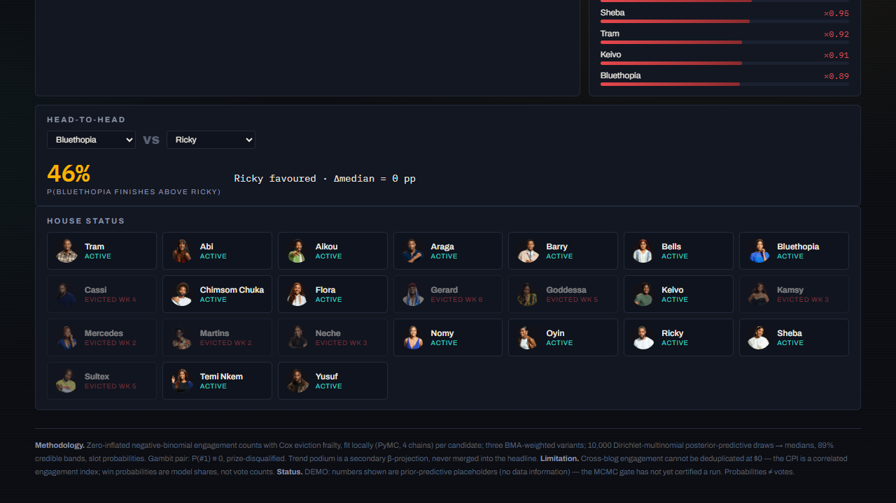

# BBNaija 2026 Predictor — Show Ya Sef

Zero-cost, local-first predictive analytics for Big Brother Naija Season 11:
blog/RSS engagement → per-housemate Engagement Index → Bayesian MCMC
(zero-inflated negative-binomial counts + Cox eviction frailty) → **weekly
predicted final standings** with win probabilities, published to a static
dashboard.

**Live dashboard:** https://batestguy.github.io/bbnaija2026/
**Mirrors:** [HF Space](https://batestguy-bbnaija2026-dashboard.static.hf.space/) · [HF Dataset archive](https://huggingface.co/datasets/batestguy/bbnaija2026-predictions)
(Currently showing **prior-predictive placeholder** data, DEMO-labeled — the
MCMC convergence gate has not yet certified a real run. See status below.)



## Status (2026-09-16)

| Piece | State |
|---|---|
| Scrapers (Google News RSS primary + blog parsers), CPI preprocessing | ✅ committed, tested |
| Modeling core (ZINB + Cox frailty, Gambit zero-out, BMA, 10k DM draws) | ✅ committed, 48+ tests |
| Weekly standings products + dashboard (all spec panels) | ✅ live on Pages (DEMO data) |
| `run_weekly.py` Saturday runner + schema/R-hat gates + last-good-file | ✅ committed |
| Push-triggered deploy (Pages + HF Space/Dataset sync, HF_TOKEN only) | ✅ committed, Pages live |
| MCMC geometry (divergences → 0 on headline candidate) | 🔧 in progress (`docs/p5-handoff.md`) |

## Methodology note (read before quoting numbers)

- **Win probabilities, not vote counts.** Probabilities are model shares of the
  winner's prize from a Bayesian survival/count model — not polls, not votes.
- **The engagement index is correlated, not independent.** The same commenters
  recur across blogs and there is no $0 way to deduplicate humans; the CPI is
  treated as a *correlated engagement index* and the model never claims
  independent voter sampling.
- **Weakly-informative priors** (Normal(0, 2.5) fixed effects, HalfNormal(1)
  variance components, LKJ(2) correlations) on standardized predictors; every
  prior value is printed to the run log and stored in the `priors` block of
  each `predictions.json`. No show-history priors; current season only.
- **Convergence gate:** any run with R-hat ≥ 1.01 is rejected; the last good
  file stays live and the dashboard flags staleness. Structural constants
  (e.g. the LKJ correlation diagonal) are excluded from R-hat; genuine
  non-convergence still rejects.
- **The Gambit twist (provisional):** viewers elect one male + one female to a
  guaranteed finale slot — immune from eviction but **disqualified from the
  grand prize**. Their P(#1) is exactly 0 (zeroed in the posterior predictive,
  never down-weighted); they remain eligible for runner-up/top-3/top-5.

## How it runs (Saturday, manual, single writer)

```bash
conda activate bap3
python run_weekly.py          # scrape → preprocess → MCMC → gates → review
git add docs/predictions.json && git commit && git push   # deploys
```

`--lite` runs reduced sampling and is honestly labeled in the output — never a
silent downgrade. No cron, no scheduled scrapes: one writer, one human push.

## The dashboard

- Trajectory chart: top-5 median win-probability with 89% credible bands,
  photo end-labels, dropdown to add housemates.
- Podium strip with slot probabilities; P(#1)/P(top-3)/P(top-5) chips;
  statistical-tie markers.
- At-risk panel (relative hazard, nominated only), trend-projected podium
  (secondary), head-to-head panel, roster with status badges.
- Gambit warning banner whenever the twist is active; DEMO/precision/staleness
  badges; methodology footer.

## Docs

- `docs/p5-handoff.md` — modeling-session history, dead ends, recovery plan
- `docs/sprint-plan-sep19.md` — go-live plan for the remaining Saturdays
- `docs/photos-runbook.md` — housemate photo pipeline (done)
- `Readme.txt` — original approved planning document

## Constraints baked into the architecture

$0 ceiling (no paid services; the only secret is an HF token for Space sync) ·
no X/Twitter API anywhere · local MCMC on CPU · push-triggered deploy-only
Actions · single-writer data directory · calendar-true week numbering from
`config/season.json`.
