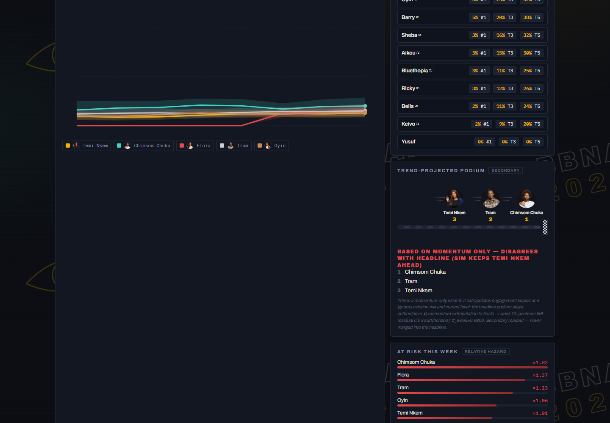

# BBNaija 2026 Win Probability — a $0 Bayesian season tracker

[](https://batestguy.github.io/bbnaija2026/)
[](https://github.com/batestguy/bbnaija2026/actions/workflows/deploy.yml)
[](#testing)

**Live:** https://batestguy.github.io/bbnaija2026/ ·
Mirrors: [HF Space](https://batestguy-bbnaija2026-dashboard.static.hf.space/) ·
[HF Dataset archive](https://huggingface.co/datasets/batestguy/bbnaija2026-predictions)

A Bayesian model that reads Nigerian entertainment blogs every week and turns housemate
buzz into **win probabilities, a podium projection, and an at-risk watch** — then publishes
them to a static dashboard. Everything runs locally on a laptop; everything is free.


## What you'll see on the dashboard

| Panel | What it tells you |
|---|---|
| **Hero call** | The model's current pick to win, with the headline probability |
| **Trajectory chart** | Predicted win-share per week for the top 5 (+ anyone you add), with 89% credible bands. Hover any line for the exact median and band; hovered line pops, others fade |
| **Podium strip** | Winner / runner-up / 2nd runner-up with slot probabilities and statistical-tie markers |
| **Rank chips** | P(#1), P(top-3), P(top-5) for all active housemates |
| **At-risk panel** | Relative eviction hazards from the survival sub-model |
| **Race to the finale** | The secondary momentum readout as a literal race: top-3 runners on a track with a week-10 checkered finish line. When this disagrees with the headline, the panel says so in red — on purpose |
| **House status** | Full 24-housemate roster: active, evicted (wk N), walked |
| **Prediction vs outcome** | Grows weekly: was last week's called winner right? Brier-scored |



<p align="center"></p>

---

## How it works — the pipeline

```
 blogs & RSS ──► scrape_blogs.py ──► preprocess.py ──► bbnaija_mcmc.py ──► predictions.json ──► deploy.yml
 (Google News    (one isolated       (gap-tolerant     (ZINB + Cox,        (median, 89% HDI,      (schema gate
  RSS primary,    parser per          weekly CPI        3 candidates,       rank probs,            then Pages +
  BellaNaija/     source,             builder, VADER    BMA-weighted)       pairwise, at-risk)     HF Space +
  Pulse/DStv      BeautifulSoup4)     sentiment)                                                   dataset)
```

Every stage is a tested CLI; `run_weekly.py` orchestrates them end-to-end on Saturdays.

**Step 1 — Scrape.** One isolated parser per source (a failure in one feed can't poison the
others): Google News RSS (primary), BellaNaija, Pulse, DStv/Africa Magic via BeautifulSoup4.
No X/Twitter anywhere — the free read tier was removed for new developers in Feb 2026.

**Step 2 — Preprocess into a weekly engagement index.** For housemate *i* in week *t*:

```
CPI(it) = 0.4·c̃(it) + 0.3·s̃(it) + 0.2·m̃(it) + 0.1·h̃(it)
```

where each term is the raw count (comments, shares, article mentions, headline features)
**min-max normalised across housemates that week** (the `̃`). If a term is unavailable for a
week, the weights renormalise over the terms that survived and the renormalisation is logged.
Sentiment per item comes from VADER polarity ∈ [−1, 1].

**Step 3 — Model.** A joint Bayesian model with a count sub-model for engagement and a
survival sub-model for evictions, sharing information through a per-housemate frailty
(details below).

**Step 4 — Products.** 10,000 Dirichlet-multinomial posterior-predictive draws → medians,
89% HDI bands, rank probabilities, pairwise "P(A finishes above B)", at-risk hazards,
statistical-tie markers (overlapping adjacent HDIs, alphabetical tie-break).

**Step 5 — Deploy.** A schema gate validates `predictions.json`; only then does GitHub Pages
publish, the HF Static Space mirror sync, and the dataset archive update. A failed gate
leaves the last good file live everywhere.

---

## The model, precisely

### Notation

| Symbol | Meaning |
|---|---|
| *i* | housemate (N = 24 entered; risk sets shrink as evictions occur) |
| *t* | week (1…10), standardised inside the model |
| *y(it)* | engagement count = round(100 · CPI(it)) |
| *S(it)* | weekly mean VADER sentiment for *i* |
| *A(it)* | 1 if *i* is nominated for eviction that week |
| *W(t)* | 1 if the season twist is active at *t* (the "Gambit") |

### Count sub-model — engagement

The observed count is zero-inflated: some housemate-weeks produce *no* coverage at all,
which is a different state from "low coverage". So the likelihood is a
**zero-inflated negative binomial (ZINB)**:

```
y(it) ~ ZINB(μ(it), ψ, α_NB)

log μ(it) = α + α_i + (β + β_i)·t + γ·S(it) + δ·A(it) + θ·W(t) + η·(W(t)·β_i)
```

| Term | Meaning |
|---|---|
| `α` | baseline log-engagement for the house |
| `α_i` | housemate effect — how much louder *i* is than the house baseline (also the Cox frailty, below) |
| `β + β_i` | house-wide trend + housemate-specific momentum |
| `γ·S(it)` | sentiment tilt — positive coverage moves more units |
| `δ·A(it)` | nomination bump — the week's nominees get written about more |
| `θ·W(t)` | the twist's house-wide attention effect |
| `η·(W(t)·β_i)` | twist heteroscedasticity — after the twist, housemate slopes spread out |
| `ψ` | zero-inflation probability (Beta(2,2) prior) |
| `α_NB` | negative-binomial overdispersion (HalfNormal(1) prior) |

### Survival sub-model — evictions

A **Cox proportional-hazards partial likelihood** over weekly risk sets (everyone still in
the house during week *t*; baseline hazard eliminated by conditioning on the risk set):

```
λ(i, t) ∝ exp(α_i)

L_cox = Π_t  exp( Σ_eventees-in-t α_i )  /  ( Σ_{j in risk set at t} exp(α_j) )^(d_t)
```

where *d_t* is the number of eviction events in week *t*. **`α_i` is the only covariate** —
the same housemate-loudness parameter drives both engagement and survival, which is what
makes the model *joint*. Output is **relative hazards only** (the at-risk panel); no absolute
eviction probabilities are claimed.

### Housemate effects — correlated, centred, non-centred

The pair `(α_i, β_i)` is modelled as correlated offsets with a sum-to-zero centre:

```
[α_i]   [s_a · z_a                    ]
[β_i] = [s_b · (ρ·z_a + √(1−ρ²)·z_b)]  −  column means
```

- `z_a, z_b ~ Normal(0,1)` per housemate (non-centred — this killed the divergences)
- `s_a ~ HalfNormal(1)`, `s_b ~ HalfNormal(sd_B)` — the variation scales
- `ρ = 2·Beta(2,2) − 1` — the LKJ(2) correlation at n = 2, exactly
- sum-to-zero centring removes the unidentifiable common-shift ridge
  (add a constant to every effect, subtract it from the population mean)

### Priors (weakly informative, fixed)

| Parameter | Prior | Rationale |
|---|---|---|
| `α, β, γ, δ, θ, η` | Normal(0, 2.5) | fixed effects; predictors standardised first |
| `s_a` | HalfNormal(1) | variance component |
| `s_b` | HalfNormal(sd_B) | **the BMA candidate knob** — see below |
| `ρ` | 2·Beta(2,2) − 1 | LKJ(2) at n = 2 |
| `ψ` | Beta(2,2) | zero-inflation, mass away from 0/1 |
| `α_NB` | HalfNormal(1) | overdispersion |

No show-history priors: **current season only, no backtesting**. Every prior value is
printed to the run log and recorded in the `priors` block of the run record.

### The Gambit twist rule (hard-coded semantics)

The Gambit pair gets immunity + a guaranteed finale seat but is **disqualified from the
prize**. This is implemented as exact zeroing in the posterior predictive — never
down-weighting:

```
P(#1 = i) = 0                              if GambitFlag_i = 1
P(#1 = i) = exp(μ_i) / Σ_{j ∉ Gambit} exp(μ_j)    otherwise
```

Runner-up / top-3 / top-5 eligibility is untouched: a Gambit housemate can podium, cannot win.
Timing comes from `config/twist.json` (`gambit_periods`), never hard-coded.

### Three candidates + Bayesian model averaging

The `s_b` scale is the only thing that differs across candidates — three beliefs about how
much housemates diverge over time:

| Candidate | `sd_B` | Story |
|---|---|---|
| momentum | 2.0 | housemates genuinely diverge over the season |
| baseline (headline) | 0.5 | housemates stay near the shared trend |
| heteroscedastic | 1.0 | divergence *spikes* after the twist |

Weights come from **Bayesian-bootstrap pseudo-BMA+** over ArviZ LOO expected log-predictive
density (1000 bootstrap replicates; candidates failing the R-hat gate get weight 0).

### Sampling, gates, and honesty labels

- **Full spec:** 4 chains × 2000 draws (after tuning), NUTS, `target_accept = 0.95`
  (the value that survived the geometry probes). **Lite fallback:** reduced draws, always
  labelled `precision: "lite"` in the products — never silently.
- **Gates:** R-hat max < 1.01 (computed over finite values only — the LKJ diagonal is a
  structural constant that would otherwise poison the max with NaN) and **zero divergences
  on the headline candidate**. A failed gate rejects the run; the last good products stay
  published and staleness is flagged on the dashboard.
- **Validation record:** the production-settings run passed with **0 divergences on all
  three candidates, R-hat max 1.0028** (`notebooks/p5_full_validation.json`).

---

## The dashboard's secondary readouts (and why they disagree)

The **trend-projected podium** is a deliberate what-if: it extrapolates each housemate's
momentum slope (β_i) to the finale and ignores eviction risk and current level. When it
disagrees with the headline (the full finale simulation), the panel says so in a red
all-caps banner and explains the mechanism. This is a feature: the two readouts answer
different questions, and the headline always stays authoritative.

## Statistical honesty

- **Probabilities are model shares, not vote counts.** Cross-blog voter independence is
  unverifiable at $0 — the same commenters recur across blogs — so the CPI is treated as a
  *correlated* engagement index. Stated here and on the dashboard itself.
- **Statistical ties** are marked, not hidden: overlapping adjacent 89% HDIs → "≈" on the
  chips, named in the podium strip, alphabetical tie-break.
- **Missed Saturdays** are backfill-bridged from archived scrapes and flagged, never
  fabricated. Mid-week DQs/walkouts are coded as evictions via `data/raw/manual_notes.csv`.
- **Gambit flags are weekly-varying** from config; the banner only appears when flags are
  active at the current week.

## Repository layout

```
run_weekly.py            Saturday entrypoint (scrape → preprocess → MCMC → gate → review)
src/scrape_blogs.py      per-source parsers (RSS primary; BeautifulSoup for the rest)
src/preprocess.py        weekly CPI builder (gap-tolerant, quarantine-aware)
src/products_schema.py   the deploy gate — validates predictions.json
notebooks/bbnaija_mcmc.py  the model + sampling + BMA + products (single file, heavily commented)
config/season.json       premiere/finale dates → calendar-true week numbering
config/twist.json        Gambit periods (weekly-varying flags)
config/housemates.json   canonical names, aliases, photo filenames
data/raw/                scrape archive (jsonl) + manual_notes.csv override channel
docs/                    the dashboard (index.html + script.js, zero dependencies) + photos
.github/workflows/deploy.yml  push-triggered deploy: schema gate → Pages + HF sync
tests/                   49 fixture-based tests (no network, no real-data dependence)
```

## Running it

```bash
# environment: any Python 3.11 with pymc 5.8 + arviz 0.16 (see docs/envs/pinned-versions.md)
python run_weekly.py          # full Saturday run (~2 h: 3 candidates x 4 chains x 2000)
python run_weekly.py --lite   # reduced draws, products honestly labelled "lite"
```

Saturday cadence: run → eyeball the console review → commit `docs/predictions.json` → push.
The deploy workflow does the rest. Missed Saturdays are bridged, never fabricated.

## Testing

49 tests, all fixture-based and offline: preprocess math (CPI weights, renormalisation,
gap tolerance), scraper parsing against saved HTML/RSS fixtures, model machinery
(Gambit zeroing, tie-breaks, BMA weighting incl. gate rejection, R-hat gate on a degraded
run), schema gate, and a right-sized end-to-end smoke.

```bash
pytest -m "not e2e"   # fast machinery suite
pytest                # everything, incl. the e2e smoke
```

## Deploy architecture

```
 git push ──► deploy.yml ──► [1] schema gate (src/products_schema.py)
                          ├─► [2] GitHub Pages  (primary, docs/)
                          ├─► [3] HF Static Space mirror (batestguy/...-dashboard)
                          └─► [4] HF Dataset archive   (batestguy/...-predictions)
```

No cron, no schedules — the only writer is the Saturday run + a human push (single-writer
rule: dual writers corrupt `data/`). Secrets: `HF_TOKEN` only. Pages needs no secret.

## Credits

**Built by JJMB** — conceived, engineered and operated by JJMB. Model, pipeline and
dashboard are original work, running entirely on a $0 stack: public blogs and RSS,
open-source Bayesian tooling (PyMC, ArviZ), and free hosting (GitHub Pages, Hugging Face).
No official data access, no paid APIs, no X/Twitter.

*Probabilities are model shares, not votes. If in doubt, trust the finish line on Sunday.*
